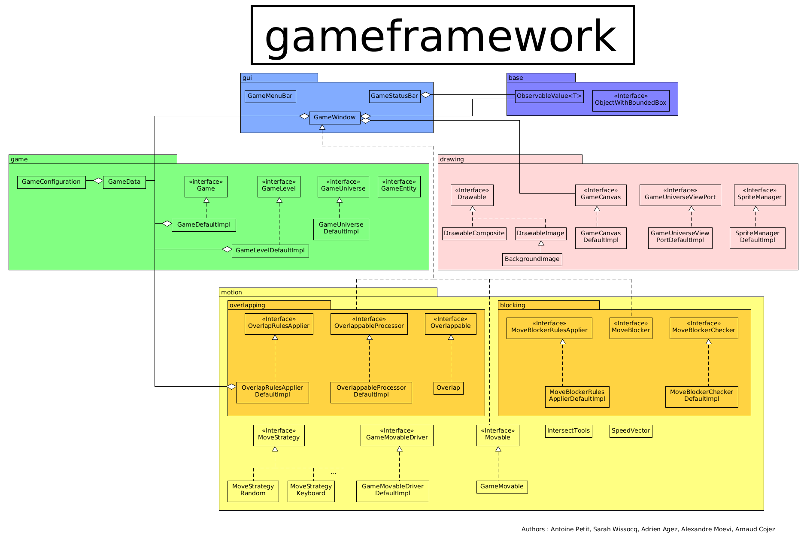

#Aide


##Partie 1 : Introduction

Ce Framework vous permettra de créer des jeux, sans avoir à vous soucier d'éléments tierces, une fois qu'ils sont biens instanciés. Toutes les collisions par exemple sont géres par le Framework, une fois que vous déclarez des objets collisionnablesbles.
<br/>
Il est assez compliqué à prendre en main, et c'est pour cela que ce mini tutoriel va vous aider à comprendre la base, pour créer votre premier prototype de jeu.

Le code d'un  est à votre disposition, pour avoir un aperçu de l'utilisation du Framework. N'hésitez donc pas à l'explorer.


##Partie 2 : Composition du Framework

Le Framework est composé en plusieurs packages, ayant chacun une fonctionnalité différente.




### gameframework.base

### gameframework.drawing

### gameframework.game

### gameframework.gui

### gameframework.motion

### gameframework.motion.blocking

### gameframework.motion.overlapping


```bash
$ mvn test
```
