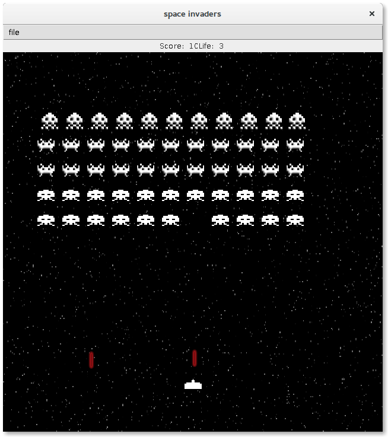
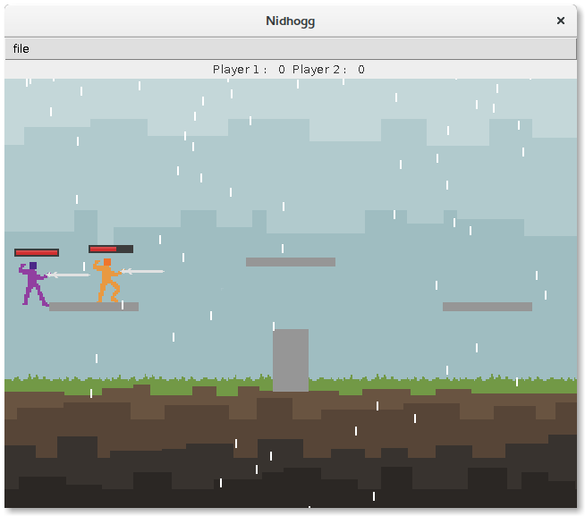
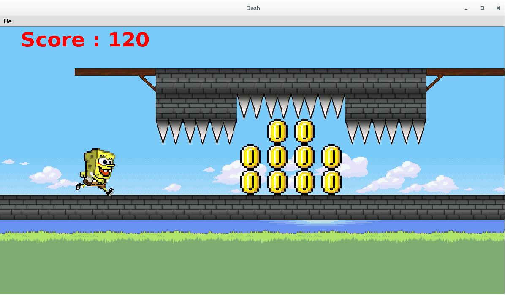
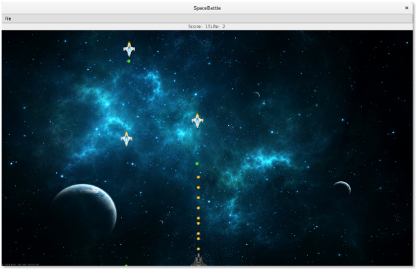
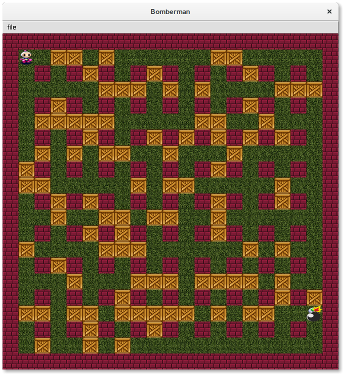

# Game Framework

[](https://travis-ci.org/DamienCassou/lille-game-framework)

As far as I know, this game framework has mostly been written by David
Auber and contains a lot of contributions from Philippe Narbel and
Damien Cassou.

To launch the tests, type:

```bash
$ mvn test
```

To develop your own game on top of this framework, you first have to
install the framework. That way, when compiling your game, maven will
find the framework:

```bash
$ mvn install
```

## Student Games

### 2016






